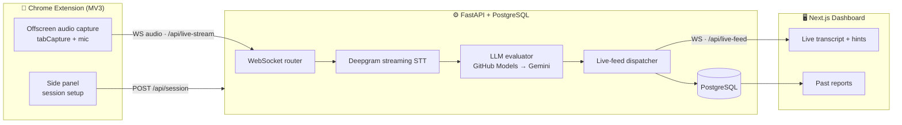

<div align="center">


# AI Interview Co-Pilot

**A real-time interview assistant** — it captures meeting audio, transcribes it live with Deepgram, and uses LLMs (GitHub Models with automatic Gemini failover) to surface interviewer rubrics or candidate answers on a live dashboard.

[](LICENSE)


[Features](#-features) · [Quick start](#-quick-start) · [How it works](#%EF%B8%8F-how-it-works) · [Configuration](#%EF%B8%8F-configuration) · [Troubleshooting](#-troubleshooting)

</div>

---

> [!IMPORTANT]
> **Please use this responsibly.** The tool records and transcribes live audio. Always get **explicit consent** from everyone on a call before recording, and follow your local laws (many regions require all-party consent). It is intended for **interview practice, self-review, and interviewer assistance** — not for deceiving anyone in a real hiring process.

---

## 👀 See it in action

The live dashboard shows the running transcript, AI-suggested answers/rubrics, and an auto-generated question bank — all updating in real time as the conversation happens.


---

## ✨ Features

| | Feature | What it does |
|---|---|---|
| 🔴 | **Live transcription** | Streams meeting audio to Deepgram Nova-2 and shows the transcript as people speak. |
| 🧠 | **Real-time AI hints** | **Interviewer mode** gives expected-answer rubrics, follow-ups, and red flags. **Interviewee mode** gives ready-to-say answers (and even solves coding/SQL/DSA problems). |
| 📄 | **Drag-and-drop resume & JD** | Drop a **PDF / DOCX / TXT** and the backend extracts the text automatically (`pypdf`, `python-docx`) — no copy-paste needed. |
| ❓ | **Ask box** | Paste any question and instantly get an answer or an evaluation rubric. |
| 🗂️ | **Auto question bank** | Generates a topic-by-topic bank ramped Easy → Hard from the detected tech stack. |
| 📊 | **Final report** | Scores, strengths/weaknesses, and a hire recommendation — saved to PostgreSQL. |
| 🔁 | **LLM failover** | Primary **GitHub Models**, automatic fallback to **Google Gemini** when rate-limited, with smart per-provider cooldowns. |
| 🛠️ | **One-command stack** | Spin up everything with the friendly `./copilot` CLI. |

---

## 🚀 Quick start

### 1️⃣ Prerequisites

- **Docker / Docker Desktop** — runs Postgres, pgAdmin, the API, and the web app
- **Node 20+** and **pnpm 9+** — to build the Chrome extension
- **Google Chrome 116+**
- **API keys** (all free to start):
  - 🎙️ [Deepgram](https://console.deepgram.com/) — required for transcription
  - 🤖 [GitHub Models](https://github.com/marketplace/models) **and/or** [Google AI Studio (Gemini)](https://aistudio.google.com/apikey) — at least one for the AI features

### 2️⃣ Configure

```bash
git clone https://github.com/robynsyngh/ai-interview-copilot
cd ai-interview-copilot
cp .env.example .env      # then paste your keys into .env
```

### 3️⃣ Start the backend, web app & database

```bash
docker compose up -d --build
# …or use the helper CLI:
./copilot start
```

| Service | URL |
|---|---|
| 🖥️ Web dashboard | http://localhost:3000 |
| ⚙️ API + interactive docs | http://localhost:8000 · http://localhost:8000/docs |
| 🗄️ pgAdmin | http://localhost:5050 |

### 4️⃣ Build & load the Chrome extension

```bash
pnpm install
pnpm dev:ext              # builds into apps/extension/dist (watch mode)
```

Then in Chrome:

1. Open `chrome://extensions` and turn on **Developer mode**.
2. Click **Load unpacked** and select the `apps/extension/dist` folder.
3. Open your meeting tab, click the extension's toolbar icon, fill in the session details, and hit **Start**.

> 💡 **Tip:** `./copilot bootup` brings up the *entire* stack **and** the extension watcher in a single command.

---

## 🏗️ How it works



| Component | Stack | Path |
|---|---|---|
| Chrome extension | TypeScript, React, crxjs/Vite, MV3 | `apps/extension/` |
| Backend API | FastAPI, SQLModel, Deepgram SDK, httpx | `apps/api/` |
| Web dashboard | Next.js 15 (App Router), React 19, Tailwind | `apps/web/` |
| Shared types | TypeScript | `packages/shared/` |
| Infrastructure | Docker Compose (Postgres, pgAdmin) | `docker-compose.yml` |

---

## ⚙️ Configuration

Everything is driven by `.env` (copy from `.env.example`):

| Variable | Description |
|---|---|
| `DEEPGRAM_API_KEY` | Deepgram key for live transcription |
| `GITHUB_MODELS_TOKEN` | GitHub PAT with the `models:read` scope |
| `GITHUB_MODELS_NAME` | Primary model, e.g. `gpt-4o` or `gpt-4o-mini` |
| `GEMINI_API_KEY` | Google AI Studio key (fallback provider) |
| `GEMINI_MODEL` | e.g. `gemini-2.0-flash` |
| `MODEL_PROVIDER_ORDER` | Failover order, e.g. `github,gemini` |
| `DATABASE_URL` | Postgres DSN (the Docker default just works) |

> [!WARNING]
> Never commit real secrets. `.env` is gitignored; only `.env.example` is tracked. Change the default Postgres password before any real deployment.

---

## 🧰 The `copilot` CLI

A single-word control panel for the dev stack — run `./copilot <command>`:

| Command | What it does |
|---|---|
| `bootup` / `shutdown` | Start/stop the whole stack **and** the extension watcher |
| `start` / `stop` / `restart` | Manage the Docker containers |
| `rebuild` / `reset` | Rebuild images (⚠️ `reset` also wipes the database) |
| `api` / `web` | Rebuild just one container |
| `logs` / `errors` | Follow or filter service logs |
| `db` / `pgadmin` | Open psql / pgAdmin |
| `health` | Ping the API health endpoint |
| `extract <file>` | Test resume/JD parsing on a local file |

---

## 🔌 Key API endpoints

| Method | Endpoint | Purpose |
|---|---|---|
| `POST` | `/api/session` | Create an interview session |
| `POST` | `/api/documents/extract` | Parse an uploaded PDF/DOCX/TXT resume or JD |
| `WS` | `/api/live-stream/{id}` | Inbound binary audio from the extension |
| `WS` | `/api/live-feed/{id}` | Outbound transcript + hint events |
| `POST` | `/api/evaluate` | Finalize the session into a report |
| `GET` | `/api/reports` | List past reports |

Explore them interactively at **http://localhost:8000/docs**.

---

## 🩺 Troubleshooting

<details>
<summary><strong>No transcription appears</strong></summary>

Check `DEEPGRAM_API_KEY` and your mic permission. On macOS: **System Settings → Privacy & Security → Microphone → enable Chrome**, then fully quit and reopen Chrome.
</details>

<details>
<summary><strong>Hints / answers are empty</strong></summary>

Your LLM key is missing or rate-limited. GitHub Models' free tier is ~150 requests/model/day — add a `GEMINI_API_KEY` so the app fails over automatically.
</details>

<details>
<summary><strong>The extension won't capture the tab</strong></summary>

Chrome's internal pages (`chrome://`, the web store, etc.) can't be captured. Click the toolbar icon on a normal meeting tab.
</details>

<details>
<summary><strong>Port already in use</strong></summary>

Stop whatever is using ports 3000 / 8000 / 5432 / 5050, or change them in `docker-compose.yml`.
</details>

---

## 🗺️ Roadmap

- [ ] Publish the extension to the Chrome Web Store
- [ ] Support more meeting platforms (Zoom web, Microsoft Teams)
- [ ] Configurable API base URL (remove `localhost` hardcoding)
- [ ] OCR fallback for scanned PDF resumes
- [ ] Authentication + multi-user sessions

---

## 🤝 Contributing

Contributions are welcome! For significant changes, please open an issue first to discuss what you'd like to do.

```bash
pnpm install
pnpm typecheck && pnpm lint          # JS / TS
cd apps/api && ruff check && mypy .  # Python
```

---

## 📜 License

Released under the [MIT License](LICENSE) © robynsyngh.

## 🙏 Acknowledgements

[Deepgram](https://deepgram.com) · [GitHub Models](https://github.com/marketplace/models) · [Google Gemini](https://ai.google.dev) · [FastAPI](https://fastapi.tiangolo.com) · [Next.js](https://nextjs.org)
