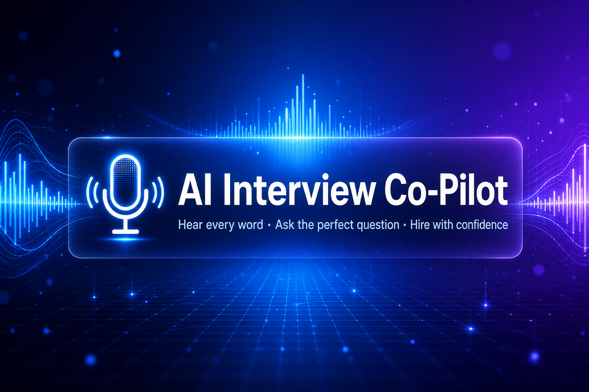
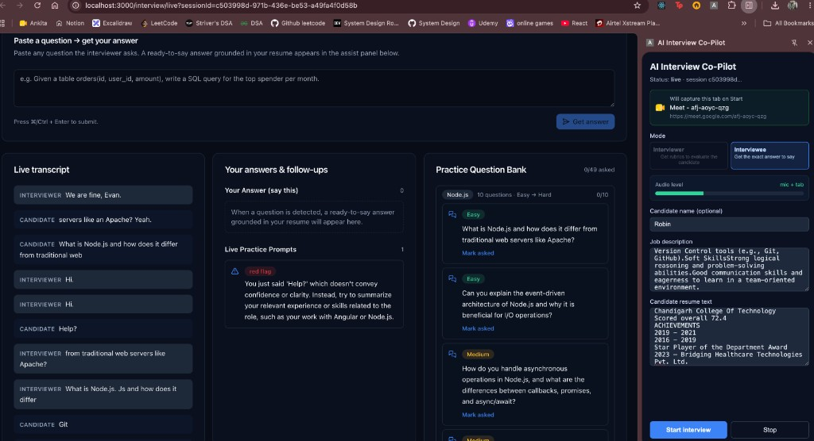
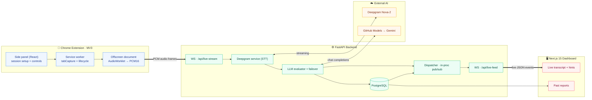
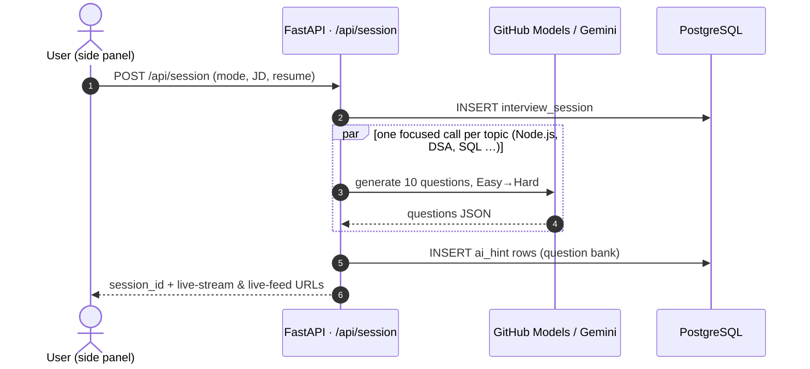
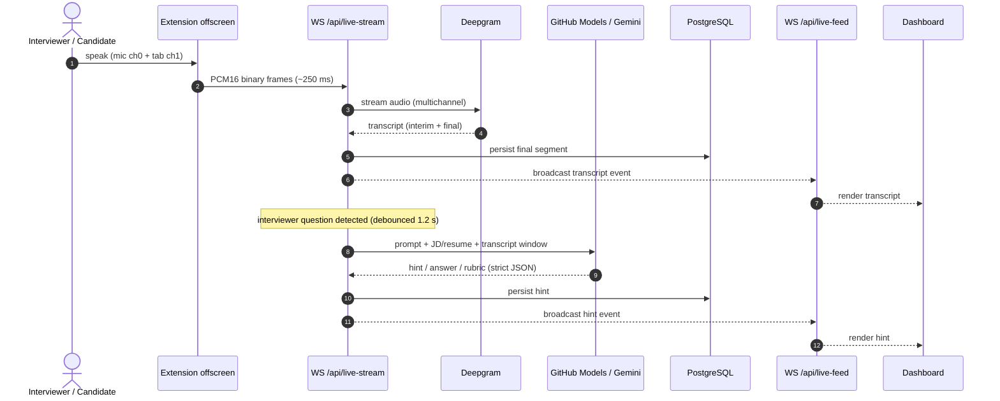
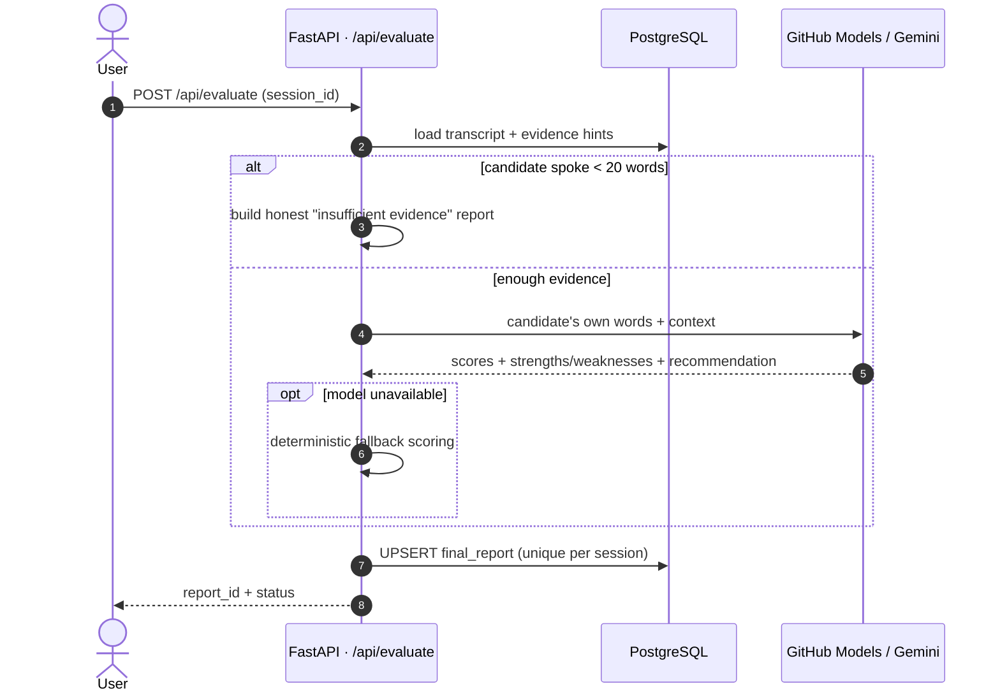
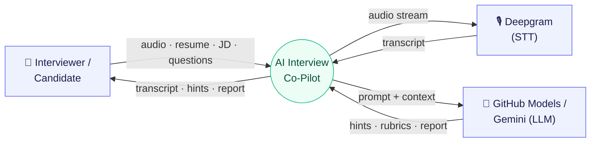
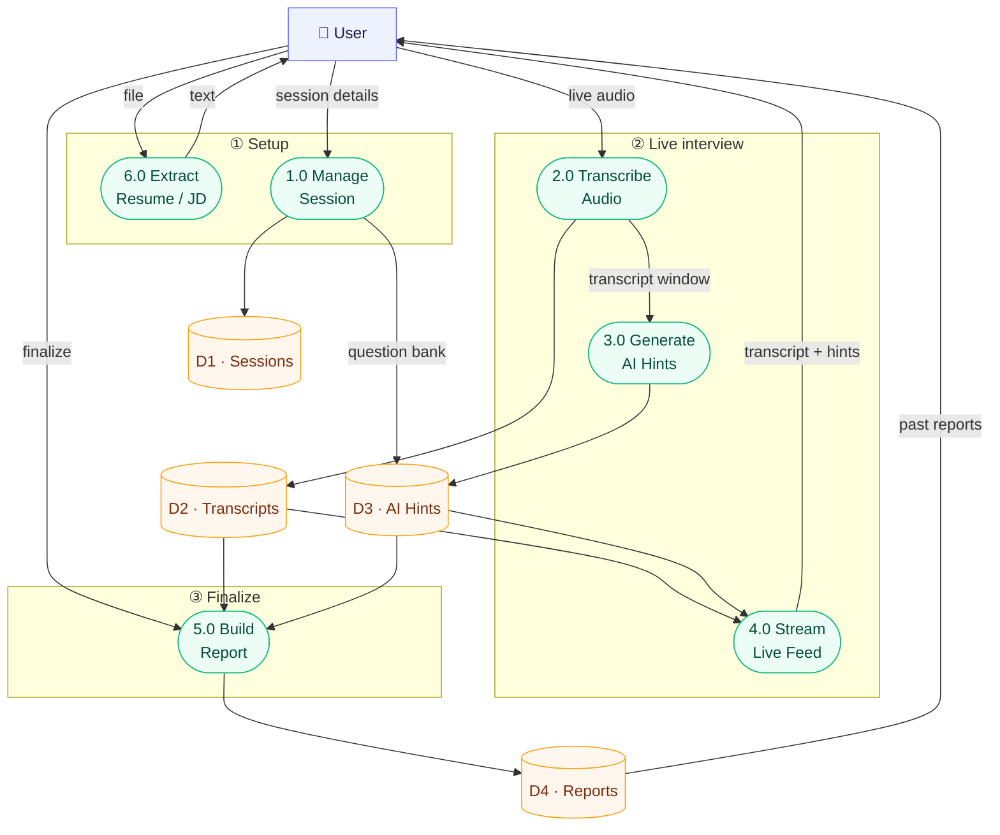
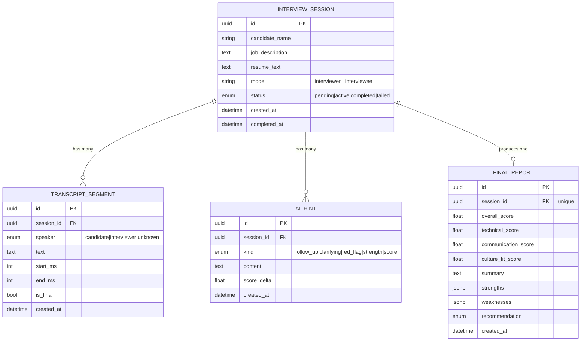

<div align="center">



# 🎯 AI Interview Co-Pilot

### _Hear every word · Ask the perfect question · Hire with confidence_

**Your real-time AI wingman for technical interviews.**
It listens to the live conversation, transcribes it instantly with **Deepgram**, and uses **LLMs** (GitHub Models with automatic Gemini failover) to whisper the perfect rubric to interviewers — or the perfect answer to candidates — on a live dashboard, then distills the entire session into a scored, hire-ready report.

[](LICENSE)


</div>

---

## 📑 Table of contents

1. [Overview](#-overview)
2. [Why it matters](#-why-it-matters)
3. [Features](#-features)
4. [System architecture](#-system-architecture)
5. [How the code flows](#-how-the-code-flows) — sequence diagrams
6. [Data flow diagram (DFD)](#-data-flow-diagram-dfd)
7. [Data model (ERD)](#-data-model-erd)
8. [Tech stack — every package, why & how](#-tech-stack--every-package-why--how)
9. [Project structure](#-project-structure)
10. [Quick start](#-quick-start)
11. [Configuration](#-configuration)
12. [The `copilot` CLI](#-the-copilot-cli)
13. [API reference](#-api-reference)
14. [Production & scaling notes](#-production--scaling-notes)
15. [Security & privacy](#-security--privacy)
16. [Troubleshooting](#-troubleshooting)
17. [Roadmap](#-roadmap) · [Contributing](#-contributing) · [License](#-license)

---

> [!IMPORTANT]
> **Please use this responsibly.** The tool records and transcribes live audio. Always get **explicit consent** from everyone on a call before recording, and follow your local laws (many regions require all-party consent). It is intended for **interview practice, self-review, and interviewer assistance** — not for deceiving anyone in a real hiring process.

---

## 📋 Overview

The **AI Interview Co-Pilot** is a real-time assistant for technical interviews. Point it at any meeting tab and it works in two directions:

- **For interviewers** → live expected-answer rubrics, smart follow-up questions, red flags to probe, and an auto-generated, structured question bank — plus a final scored report with a hire recommendation.
- **For candidates (practice)** → ready-to-say answers to spoken questions in real time, including worked solutions to coding / SQL / DSA problems, so you can rehearse under realistic pressure.

Everything updates **live, on one screen**, while the conversation happens — no note-taking, no copy-paste, no context switching.

### At a glance

| | |
|---|---|
| **What it is** | A real-time, AI-powered interview co-pilot (Chrome extension + web dashboard + API). |
| **Who it's for** | Hiring teams, interviewers, and candidates practicing for interviews. |
| **Core value** | Faster, fairer, more consistent interviews — with an auditable record and an objective score. |
| **Inputs** | Live meeting audio, resume & job description (PDF / DOCX / TXT), typed questions. |
| **Outputs** | Live transcript, AI hints/answers, a question bank, and a final scored report. |
| **Powered by** | Deepgram (speech-to-text) · GitHub Models + Google Gemini (LLM, with failover). |
| **Status** | Self-hostable, runs locally with one command. Free-tier API keys to start. |

---

## 💼 Why it matters

A real-time co-pilot turns interviews from ad-hoc conversations into a **consistent, measurable, and defensible process**.

| Outcome | How the Co-Pilot delivers it |
|---|---|
| 🎯 **More consistent hiring** | Every interviewer gets the same rubric-driven prompts and a structured question bank, reducing interviewer-to-interviewer variance. |
| ⚡ **Higher interviewer productivity** | No manual note-taking — the transcript, hints, and scoring are generated automatically, freeing the interviewer to engage with the candidate. |
| 📊 **Objective, auditable decisions** | Each session ends in a scored report (technical / communication / culture-fit) with strengths, weaknesses, and a hire recommendation — saved to a database for review. |
| 🛡️ **Evidence-gated fairness** | Scores are built from the **candidate's own words**, with a hard gate that refuses to invent a positive evaluation when there isn't enough evidence. |
| 💸 **Low cost to run** | Starts on free API tiers; automatic provider failover keeps it running when one provider is rate-limited. |
| 🔒 **You own the data** | Self-hosted: audio, transcripts, and reports live in **your** PostgreSQL, not a third-party SaaS. |

---

## ✨ Features

| | Feature | What it does |
|---|---|---|
| 🔴 | **Live transcription** | Streams meeting audio to Deepgram Nova-2 and shows the transcript as people speak, with speaker separation. |
| 🧠 | **Real-time AI hints** | **Interviewer mode** gives expected-answer rubrics, follow-ups, and red flags. **Interviewee mode** gives ready-to-say answers (and even solves coding/SQL/DSA problems). |
| 📄 | **Drag-and-drop resume & JD** | Drop a **PDF / DOCX / TXT** and the backend extracts the text automatically (`pypdf`, `python-docx`) — no copy-paste needed. |
| ❓ | **Ask box** | Paste any question and instantly get an answer or an evaluation rubric. |
| 🗂️ | **Auto question bank** | Generates a topic-by-topic bank ramped Easy → Hard from the detected tech stack. |
| 📊 | **Final report** | Scores, strengths/weaknesses, and a hire recommendation — saved to PostgreSQL. |
| 🔁 | **LLM failover** | Primary **GitHub Models**, automatic fallback to **Google Gemini** when rate-limited, with smart per-provider cooldowns. |
| 🛠️ | **One-command stack** | Spin up everything with the friendly `./copilot` CLI. |

### 👀 See it in action

The live dashboard shows the running transcript, AI-suggested answers/rubrics, and an auto-generated question bank — all updating in real time as the conversation happens.



---

## 🏗️ System architecture

Three apps in a pnpm monorepo share typed contracts and talk to one FastAPI backend backed by PostgreSQL. External AI (Deepgram + LLM providers) is called only from the backend, so no secret ever reaches the browser.



| Layer | Stack | Path |
|---|---|---|
| Chrome extension | TypeScript, React 19, crxjs/Vite, MV3 (offscreen, tabCapture, side panel) | `apps/extension/` |
| Backend API | FastAPI, SQLModel, Deepgram SDK, httpx, structlog | `apps/api/` |
| Web dashboard | Next.js 15 (App Router), React 19, Tailwind | `apps/web/` |
| Shared types | TypeScript DTOs shared by web + extension | `packages/shared/` |
| Infrastructure | Docker Compose (Postgres 16, pgAdmin) | `docker-compose.yml` |

---

## 🔁 How the code flows

Sequence diagrams are the clearest way to see *how data and control move through the actual modules* over time. The code is even annotated with the matching process markers (`P1`–`P8`).

### 1) Session setup & question-bank generation

`apps/extension/.../sidepanel/App.tsx` → `POST /api/session` → `routers/session.py` → `services/github_models.py`



### 2) Live transcription & real-time hints (the core loop)

`offscreen.ts` → `WS /api/live-stream` (`routers/live_stream.py`) → Deepgram → LLM → dispatcher → `WS /api/live-feed` → dashboard.



**Why it's robust:** one in-flight LLM call per session (throttled), question **debouncing** so half-spoken questions aren't answered, newer questions **supersede** stale in-flight answers, and near-duplicate hints are dropped — all in `routers/live_stream.py`.

### 3) Finalize & scored report

`POST /api/evaluate` → `routers/evaluate.py` (evidence-gated) → `services/github_models.py`.



---

## 🔀 Data flow diagram (DFD)

> **Legend** — `▭` external entity · `( )` process · `[( )]` data store.

### Level 0 — context



### Level 1 — processes & data stores

Grouped by phase to keep the flow linear and readable. (External STT/LLM exchanges for processes 2/3/5 are detailed in the sequence diagrams above.)



| Process | Responsibility | Code |
|---|---|---|
| **1.0 Manage Session** | Create session, seed question bank, toggle mode | `routers/session.py` |
| **2.0 Transcribe Audio** | Receive audio over WS, run Deepgram STT, persist segments | `routers/live_stream.py` · `services/deepgram.py` |
| **3.0 Generate AI Hints** | Build prompts, call the LLM, de-dupe, persist hints | `services/github_models.py` |
| **4.0 Stream Live Feed** | Fan transcript + hint events out to dashboards | `routers/live_feed.py` · `services/dispatcher.py` |
| **5.0 Build Report** | Score the candidate from their own words, save report | `routers/evaluate.py` |
| **6.0 Extract Resume / JD** | Parse uploaded PDF/DOCX/TXT into text | `routers/documents.py` · `services/document_extract.py` |

---

## 🗃️ Data model (ERD)

Four tables in PostgreSQL, all cascading from a session (`apps/api/app/models/`).



---

## 📦 Tech stack — every package, why & how

Every production dependency below is intentional. Tables list **why** it was chosen, **how** it's used in this repo, and the **impact** it has.

### Backend — `apps/api` (Python 3.11)

| Package | Why chosen | How it's used here | Impact |
|---|---|---|---|
| **fastapi** | Async-first web framework with first-class WebSocket + OpenAPI | HTTP routers (`session`, `documents`, `evaluate`, `reports`) and two WS routers (`live-stream`, `live-feed`) in `app/routers/` | Low-latency real-time endpoints + free interactive `/docs` |
| **uvicorn[standard]** | High-performance ASGI server (uvloop, httptools, websockets) | Runs the app (`uvicorn app.main:app`) in the Docker container | Fast event loop that sustains streaming audio + many WS clients |
| **websockets** | Mature WS protocol implementation | Backs the binary audio ingress and JSON event egress | Reliable, backpressure-aware real-time transport |
| **sqlmodel** | SQLAlchemy + Pydantic in one typed model layer | All four tables in `app/models/`; queries in routers | One typed source of truth for DB rows *and* validation |
| **psycopg[binary]** | Modern, fast PostgreSQL 3.x driver | `DATABASE_URL=postgresql+psycopg://…`; engine in `app/db.py` | Stable, performant Postgres connectivity, no system libpq needed |
| **pydantic** + **pydantic-settings** | Validated DTOs + typed env config | `app/schemas/messages.py` request/response models; `app/config.py` settings | Crash-early on bad input/config; self-documenting contracts |
| **python-dotenv** | Load `.env` for local/dev | Reads keys into settings | One-file configuration, no secrets in code |
| **httpx** | Async HTTP/2 client with timeouts | `services/github_models.py` calls GitHub Models & Gemini `/chat/completions`; per-provider clients + failover | Non-blocking LLM calls; clean 429/5xx failover & cooldowns |
| **python-multipart** | Multipart form parsing | `POST /api/documents/extract` file upload | Enables drag-and-drop resume/JD upload |
| **deepgram-sdk** (3.x) | Official streaming STT SDK (async WS) | `services/deepgram.py` opens a live Nova-2 connection, keyword boosting, multichannel speaker mapping | Accurate, real-time, speaker-separated transcripts |
| **structlog** | Structured (JSON) logging | Every service/router logs events (`model_completion`, `deepgram_started`, …) | Production-grade, queryable, contextual logs |
| **pypdf** | Pure-Python PDF parsing | `services/document_extract.py` extracts resume/JD PDF text | Zero-setup PDF ingestion |
| **python-docx** | Word `.docx` parsing | Same module, extracts paragraphs + tables | Accept the formats recruiters actually send |
| _dev:_ **pytest / pytest-asyncio** | Async test runner | Backend tests | Confidence on async pipeline behavior |
| _dev:_ **ruff** | Fast linter + import sorter | `ruff check` (E, F, I, B, UP, ASYNC, S, N) | Consistent, secure, idiomatic Python |
| _dev:_ **mypy** (strict) | Static type checker | `mypy .` with the pydantic plugin | Catches type bugs before runtime |

### Web dashboard — `apps/web` (Next.js 15)

| Package | Why chosen | How it's used here | Impact |
|---|---|---|---|
| **next** (15, App Router) | SSR + RSC + routing in one framework | `app/interview/live` (client, WS-driven), `app/reports` (server-rendered) | Fast first paint + a clean live/SSR split |
| **react** / **react-dom** (19) | Component UI + hooks | Live transcript & hints panes, ask box, reports | Declarative, real-time UI updates |
| **tailwindcss** + **postcss** + **autoprefixer** | Utility-first styling pipeline | `globals.css` + component classes | Fast, consistent, responsive styling |
| **clsx** + **tailwind-merge** | Safe conditional class composition | Toggle hint/transcript/state styles without class clashes | Predictable styling, no specificity bugs |
| **lucide-react** | Lightweight, tree-shakeable icons | Dashboard/nav iconography | Crisp UI at minimal bundle cost |
| _dev:_ **eslint** + **eslint-config-next** | Next-aware linting | `next lint` | Catches React/Next pitfalls early |
| _dev:_ **typescript** + **@types/** | End-to-end type safety | Whole app + shared DTOs | Fewer runtime UI bugs |

### Chrome extension — `apps/extension` (MV3)

| Package / API | Why chosen | How it's used here | Impact |
|---|---|---|---|
| **@crxjs/vite-plugin** | MV3 manifest build + HMR for extensions | Builds `dist/` (manifest, side panel, offscreen, service worker) | One command produces a loadable MV3 extension |
| **vite** + **@vitejs/plugin-react** | Fast bundler/dev server | `pnpm dev:ext` watch build | Instant rebuilds during development |
| **react** / **react-dom** (19) | Side-panel UI | `sidepanel/App.tsx` session setup, audio meter, toasts | Polished capture-control UX in a narrow panel |
| **@types/chrome** | Typed Chrome extension APIs | Across background/offscreen/side panel | Type-safe use of MV3 APIs |
| **Chrome `offscreen`** (platform) | Run `getUserMedia`/AudioContext off the SW | `offscreen.ts` captures + encodes audio | MV3-compliant audio capture (SWs can't) |
| **Chrome `tabCapture`** (platform) | Capture meeting tab audio | `background/index.ts` `getMediaStreamId` per invoked tab | Reliable activeTab-scoped capture |
| **Chrome `sidePanel`** (platform) | Persistent side-panel UI | Opened on toolbar click | Stays open beside the meeting |
| **AudioWorklet + WebSocket** (platform) | Real-time PCM16 encode + transport | Merges mic ch0 + tab ch1 → PCM16 → WS frames | Speaker-separable, low-latency audio to the API |

### Shared & infrastructure

| Package / Tool | Why chosen | How it's used here | Impact |
|---|---|---|---|
| **`packages/shared`** (TypeScript) | One source of truth for cross-app DTOs | `CreateSessionRequest`, `*Response`, message types imported by web + extension | Compile-time contract safety between client apps |
| **pnpm workspaces** | Fast, disk-efficient monorepo | Root `package.json` orchestrates `-r` builds/lint/typecheck | Consistent tooling across all apps |
| **Docker Compose** | Reproducible local stack | `postgres:16-alpine`, `dpage/pgadmin4`, `api`, `web` services | `docker compose up` brings up everything |
| **PostgreSQL 16** | Reliable relational store + JSONB | Sessions, transcripts, hints, reports (JSONB strengths/weaknesses) | Durable, queryable interview history |

---

## 🗂️ Project structure

```text
ai-interview-copilot/
├─ apps/
│  ├─ api/                 # FastAPI backend
│  │  └─ app/
│  │     ├─ main.py        # app + router wiring (DFD edges)
│  │     ├─ config.py      # pydantic-settings env config
│  │     ├─ db.py          # SQLModel engine / init
│  │     ├─ models/        # session, transcript, hint, report (tables)
│  │     ├─ schemas/       # pydantic request/response DTOs
│  │     ├─ routers/       # session, documents, live_stream, live_feed, evaluate, reports
│  │     └─ services/      # deepgram, github_models, dispatcher, document_extract
│  ├─ web/                 # Next.js 15 dashboard (live view + reports)
│  └─ extension/           # Chrome MV3 (side panel, service worker, offscreen)
├─ packages/
│  └─ shared/              # shared TypeScript DTOs/messages
├─ copilot                 # dev CLI (start/stop/logs/db/…)
├─ docker-compose.yml      # postgres, pgadmin, api, web
└─ .env.example            # configuration template
```

---

## 🚀 Quick start

### 1️⃣ Prerequisites

- **Docker / Docker Desktop** — runs Postgres, pgAdmin, the API, and the web app
- **Node 20+** and **pnpm 9+** — to build the Chrome extension
- **Google Chrome 116+**
- **API keys** (all free to start):
  - 🎙️ [Deepgram](https://console.deepgram.com/) — required for transcription
  - 🤖 [GitHub Models](https://github.com/marketplace/models) **and/or** [Google AI Studio (Gemini)](https://aistudio.google.com/apikey) — at least one for the AI features

### 2️⃣ Configure

```bash
git clone https://github.com/robynsyngh/ai-interview-copilot
cd ai-interview-copilot
cp .env.example .env      # then paste your keys into .env
```

### 3️⃣ Start the backend, web app & database

```bash
docker compose up -d --build
# …or use the helper CLI:
./copilot start
```

| Service | URL |
|---|---|
| 🖥️ Web dashboard | http://localhost:3000 |
| ⚙️ API + interactive docs | http://localhost:8000 · http://localhost:8000/docs |
| 🗄️ pgAdmin | http://localhost:5050 |

### 4️⃣ Build & load the Chrome extension

```bash
pnpm install
pnpm dev:ext              # builds into apps/extension/dist (watch mode)
```

Then in Chrome:

1. Open `chrome://extensions` and turn on **Developer mode**.
2. Click **Load unpacked** and select the `apps/extension/dist` folder.
3. Open your meeting tab, click the extension's toolbar icon, fill in the session details, and hit **Start**.

> 💡 **Tip:** `./copilot bootup` brings up the *entire* stack **and** the extension watcher in a single command.

---

## ⚙️ Configuration

Everything is driven by `.env` (copy from `.env.example`):

| Variable | Description |
|---|---|
| `DEEPGRAM_API_KEY` | Deepgram key for live transcription |
| `GITHUB_MODELS_TOKEN` | GitHub PAT with the `models:read` scope |
| `GITHUB_MODELS_NAME` | Primary model, e.g. `gpt-4o` or `gpt-4o-mini` |
| `GEMINI_API_KEY` | Google AI Studio key (fallback provider) |
| `GEMINI_MODEL` | e.g. `gemini-2.0-flash` |
| `MODEL_PROVIDER_ORDER` | Failover order, e.g. `github,gemini` |
| `DATABASE_URL` | Postgres DSN (the Docker default just works) |

> [!WARNING]
> Never commit real secrets. `.env` is gitignored; only `.env.example` is tracked. Change the default Postgres password before any real deployment.

---

## 🧰 The `copilot` CLI

A single-word control panel for the dev stack — run `./copilot <command>`:

| Command | What it does |
|---|---|
| `bootup` / `shutdown` | Start/stop the whole stack **and** the extension watcher |
| `start` / `stop` / `restart` | Manage the Docker containers |
| `rebuild` / `reset` | Rebuild images (⚠️ `reset` also wipes the database) |
| `api` / `web` | Rebuild just one container |
| `logs` / `errors` | Follow or filter service logs |
| `db` / `pgadmin` | Open psql / pgAdmin |
| `health` | Ping the API health endpoint |
| `extract <file>` | Test resume/JD parsing on a local file |

---

## 🔌 API reference

| Method | Endpoint | Purpose |
|---|---|---|
| `POST` | `/api/session` | Create an interview session (+ seed question bank) |
| `GET` | `/api/session/{id}` | Fetch session info |
| `PATCH` | `/api/session/{id}/mode` | Switch interviewer/interviewee mode live |
| `POST` | `/api/session/{id}/ask` | Ask a typed question → answer/rubric |
| `POST` | `/api/documents/extract` | Parse an uploaded PDF/DOCX/TXT resume or JD |
| `WS` | `/api/live-stream/{id}` | Inbound binary audio from the extension |
| `WS` | `/api/live-feed/{id}` | Outbound transcript + hint events |
| `POST` | `/api/evaluate` | Finalize the session into a report |
| `GET` | `/api/reports` · `/api/reports/{id}` | List / fetch past reports |

Explore them interactively at **http://localhost:8000/docs**.

---

## 📈 Production & scaling notes

This runs great on one box; here's the path to scale, by design.

- **Stateless API, single source of truth.** All durable state is in PostgreSQL — the API can run multiple replicas behind a load balancer.
- **The one in-process component is the dispatcher.** `services/dispatcher.py` is an in-memory pub/sub for `live-feed`. To scale horizontally, swap its `_subscribers` dict for **Redis Pub/Sub or NATS** — the public `subscribe/broadcast/unsubscribe` API is intentionally identical, so callers don't change.
- **WebSocket affinity.** A given session's `live-stream` and `live-feed` should land on the same instance (or use a shared bus as above). Use sticky sessions or a fan-out bus.
- **LLM cost & resilience.** Per-session throttling (one in-flight call), question debouncing, near-duplicate suppression, and **per-provider 429 cooldowns with automatic failover** keep cost and latency bounded.
- **Graceful degradation.** No `DEEPGRAM_API_KEY` → synthetic transcript stream for demos; no/exhausted LLM keys → deterministic fallback report. The app never hard-crashes the interview loop.
- **Backpressure.** `live-feed` queues are bounded (`maxsize=256`) and drop on overflow with a logged warning rather than growing unbounded.
- **Observability.** Structured JSON logs (`structlog`) on every hop; `/health` endpoint for liveness probes.

---

## 🔒 Security & privacy

- **Secrets stay server-side.** Deepgram/LLM keys live only in the backend; the browser never sees them.
- **Consent-first.** Recording requires explicit consent (see the note at the top); the extension cannot capture Chrome internal pages.
- **Self-hosted data.** Transcripts, hints, and reports live in your own Postgres; nothing is sent to a third-party product analytics SaaS.
- **Input guard rails.** Uploads are capped (8 MB) and text is bounded (60k chars) to prevent resource exhaustion.
- **Evidence-gated scoring.** The report refuses to fabricate a positive evaluation without real candidate answers.
- **Before deploying:** change the default Postgres password, restrict CORS origins, put the API behind TLS, and add authentication (see roadmap).

---

## 🩺 Troubleshooting

<details>
<summary><strong>No transcription appears</strong></summary>

Check `DEEPGRAM_API_KEY` and your mic permission. On macOS: **System Settings → Privacy & Security → Microphone → enable Chrome**, then fully quit and reopen Chrome.
</details>

<details>
<summary><strong>Hints / answers are empty</strong></summary>

Your LLM key is missing or rate-limited. GitHub Models' free tier is ~150 requests/model/day — add a `GEMINI_API_KEY` so the app fails over automatically.
</details>

<details>
<summary><strong>The extension won't capture the tab</strong></summary>

Chrome's internal pages (`chrome://`, the web store, etc.) can't be captured. Click the toolbar icon on a normal meeting tab.
</details>

<details>
<summary><strong>Port already in use</strong></summary>

Stop whatever is using ports 3000 / 8000 / 5432 / 5050, or change them in `docker-compose.yml`.
</details>

---

## 🗺️ Roadmap

- [ ] Publish the extension to the Chrome Web Store
- [ ] Support more meeting platforms (Zoom web, Microsoft Teams)
- [ ] Configurable API base URL (remove `localhost` hardcoding)
- [ ] OCR fallback for scanned PDF resumes
- [ ] Authentication + multi-user sessions
- [ ] Redis/NATS-backed dispatcher for horizontal scaling

---

## 🤝 Contributing

Contributions are welcome! For significant changes, please open an issue first to discuss what you'd like to do.

```bash
pnpm install
pnpm typecheck && pnpm lint          # JS / TS
cd apps/api && ruff check && mypy .  # Python
```

---

## 📜 License

Released under the [MIT License](LICENSE) © robynsyngh.

## 🙏 Acknowledgements

[Deepgram](https://deepgram.com) · [GitHub Models](https://github.com/marketplace/models) · [Google Gemini](https://ai.google.dev) · [FastAPI](https://fastapi.tiangolo.com) · [Next.js](https://nextjs.org)
